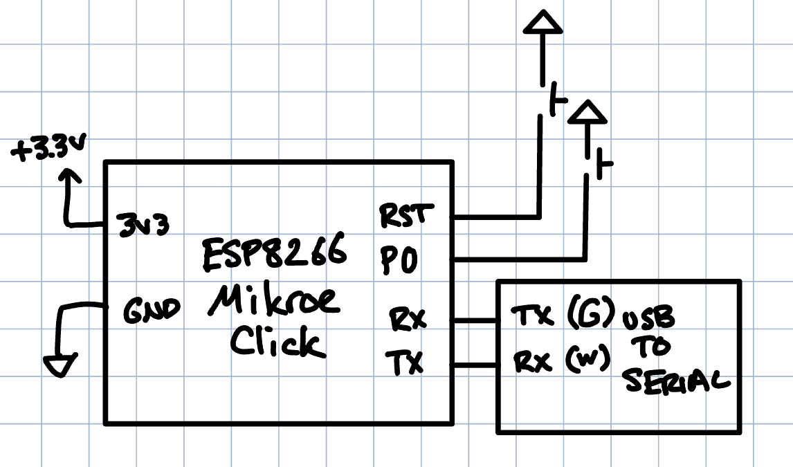

# ESP8266 Webserver Code

## Overview

This code hosts a webserver displaying webpages sent over UART.

In more detail:

1) The web server starts a 125000 baud serial connection over the hardware UART (for debug)
2) The web server connects to a given network or creates its own.
3) The web server waits for a request from the client. When it receives one, it transmits /REQ:<path>\n to the MCU. 

Step 3 is repeated while the program runs

## Connecting to ESP

1) Connect to the ESP's WiFi network
2) Go to http://192.168.4.1/ after your computer is assigned an IP address by the ESP. 

## Programming the ESP

Connect the ESP8266 Click board as shown below.

To program, you need to reset the board while the programming pin is held down.
The pins to program are also broken out on the through-hole headers on the Mikroe Click board.

Instructions from [here](https://learn.edwinrobotics.com/getting-started-with-esp-wroom-02/).

- Ground both the RESET (nRST) and PROGRAM (GPIO 0) pins.
- Release the RESET pin while continuing to ground the PROGRAM (GPIO 0) pin for one more second.
- Release the PROGRAM pin (GPIO 0). Now you are in UART Download mode.

## Acknowledgements
This code was originally developed by Erik Meike and Kaveh Pezeshki and Christopher Ferrarin.
It was updated and modified by Josh Brake in the Fall of 2019.
